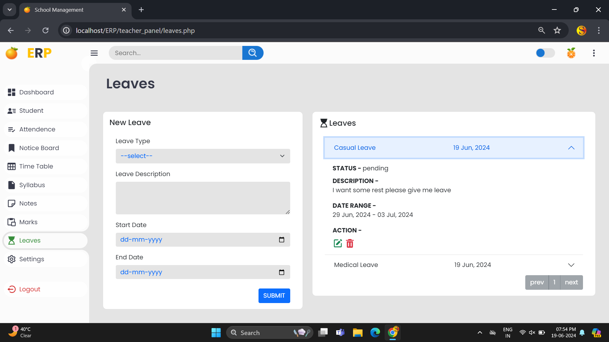
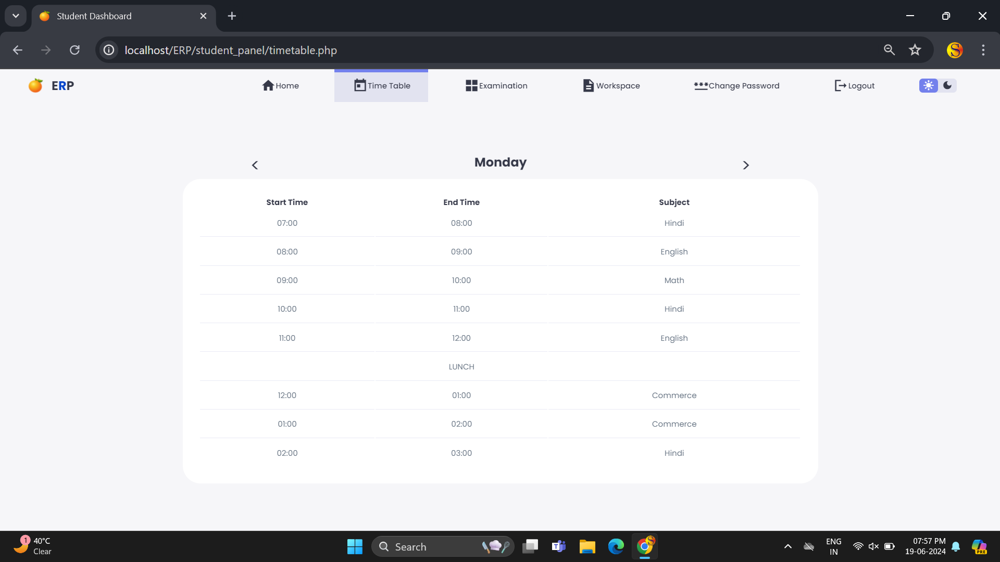
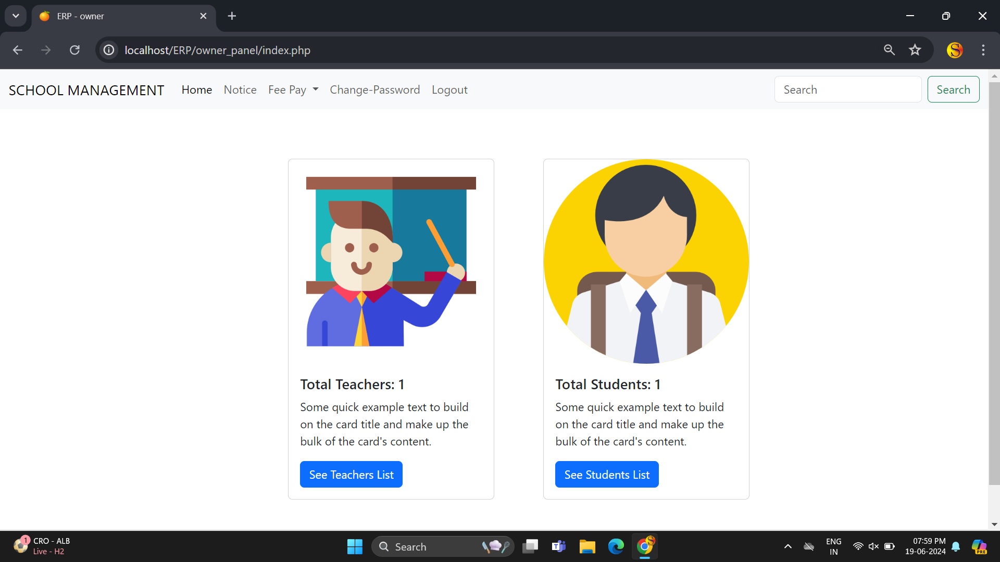

# 🍊 school-management-system 
PHP School management system developed for schools or small institutes. You can use this to maintain record's related to students, teachers, and other. [Click here to view a live demo](https://sms.oranbyte.com)


## 🥏 Technolgies Used 
  1. PHP (8.1) 
  2. MySQL database  
  3. Bootstrap 5
  4. JQuery, JavaScript
  5. HTML, CSS

## 💡 FEATURES 
  1. student record management
  2. Teacher record management 
  3. Leave Management
  4. Notice Upload 
  5. Exam result upload
  6. Notes upload
  7. Bus Service  
  8. Syllabus upload / update
  9. Time table
  10. Attendence Management
  11. Password reset, Forgot password
  12. Front Page 
  13. Single login
  14. Dark theme support
  15. Multi-Language Support <small style="color: orange;">(new)</small>

## 🦤 SCREENSHOTS

### Pre-View
<div style="display: flex;flex-direction: column; grid-gap: 10px;">
     <div style="display: flex; grid-gap: 10px;">
        
        
    </div>
</div>
<br>

### Admin View
<div style="display: flex;flex-direction: column; grid-gap: 10px;">
   <div style="display: flex; grid-gap: 10px;">
        
        
    </div>
     <div style="display: flex; grid-gap: 10px;">
        
        
    </div>
     <div style="display: flex; grid-gap: 10px;">
        
        
    </div>
     <div style="display: flex; grid-gap: 10px;">
        
        
    </div>
</div>
<br>

### Teacher View
<div style="display: flex;flex-direction: column; grid-gap: 10px;">
    <div style="display: flex; grid-gap: 10px;">
        
        
    </div>
</div>
<br>

### Student View
<div style="display: flex;flex-direction: column; grid-gap: 10px;">
   <div style="display: flex; grid-gap: 10px;">
        
        
    </div>
    <div style="display: flex; grid-gap: 10px;">
        
        
    </div>
    <div style="display: flex; grid-gap: 10px;">
        
    </div>
    
</div>
<br>


### Owner View
<div style="display: flex;flex-direction: column; grid-gap: 10px;">
    <div style="display: flex; grid-gap: 10px;">
        
        
    </div>
    
</div>
<br>

## ✅ HOW TO USE?

  <b>Pre-requirement</b> : Make sure you have both php and MySQL installed on your PC. You can also use XAMPP which provide BOTH (php + MySQL).<br><br>

 <b>Step-1 :</b> Start XAMPP <br>
   Open XAMPP Control panel and start the Apache And MySQL Server  <br>

 <b>Step-2 :</b> Create Database <br>
   <b>The schema file of the database setup is available at database/_sms.sql </b>
   <br><br>
   From you xampp open phpmyadmin by clicking on admin button in front of MySQL -> create a database with the name '_sms' -> import the  database/_sms.sql file to complete the database setup.<br>

<b>Step-3 :</b> Placement <br>
   <b> If you have xampp installed on your PC you need to place the downloaded folder on 'htdocs directory' </b>
   <br><br>
   Copy the downloaded folder and place it into htdocs folder. Located at <i>C:\xampp\htdocs</i>
   <br><br>
   make sure your directory setup is like : <i>C:\xampp\htdocs\school-management-system\ </i> : and index.php file is available on the that location

<b>Step-4 :</b> Run the application <br>
   <b> visit on the url : <i>http://localhost/school-management-system</i> </b>
   <br> Visit to the given URL to see the running website

## 🔐 Emails and Passwords

The project comes with default user on each panel you can remove and update them also.<br>
The **Credentials** for default logins are

| Panel   |  Email             | Password |
| ----:   |  :---------------- | :------: |
| Admin   | admin@gmail.com    | 123      |
| Teacher | teacher@gmail.com  | 123      |
| Student | student@gmail.com  | 123      |
| Owner   | owner@gmail.com    | 123      |

- Note : **Password for New Teachers and Students:**  
   The default password for newly created teacher and student accounts is set to their **date of birth**.  
   - Example: If the date of birth is **12 July 2000**, the password would be **12072000**.

## ❤️ Contributing

Pull requests are welcome. For major changes, please open an issue first
to discuss what you would like to change.

Please make sure to update tests as appropriate.


-------------------------------------------------------------------------
# HƯỚNG DẪN SỬ DỤNG MEMBERS MANAGEMENT SYSTEM

## 📋 MÔ TẢ

Hệ thống quản lý thông tin thành viên (members) cho Admin Panel.
- ✅ **Add Member**: Admin thêm thông tin cá nhân của member (KHÔNG tạo account đăng nhập)
- ✅ **Edit Member**: Sửa thông tin cá nhân
- ✅ **Delete Member**: Xóa member khỏi hệ thống
- ✅ **View Member**: Xem chi tiết thông tin member

## 📁 CẤU TRÚC FILE

```
admin_panel/
├── members.php              → Trang UI quản lý members
├── members_handler.php      → Backend xử lý CRUD operations
└── ...

database/
└── create_members_table.sql → SQL script tạo bảng members
```

## 🚀 CÁCH CÀI ĐẶT

### Bước 1: Tạo Database Table

1. Mở phpMyAdmin hoặc MySQL client
2. Chạy file `create_members_table.sql` để tạo bảng `members`
3. Bảng sẽ có cấu trúc:
   - `id` - Primary key
   - `student_id` - Mã số sinh viên (unique)
   - `full_name` - Họ tên đầy đủ
   - `phone` - Số điện thoại
   - `email` - Email (unique)
   - `created_at` - Ngày tạo
   - `updated_at` - Ngày cập nhật

### Bước 2: Upload Files

1. Copy `members.php` vào thư mục `admin_panel/`
2. Copy `members_handler.php` vào thư mục `admin_panel/`

### Bước 3: Kiểm tra Kết nối Database

Đảm bảo file `../assets/config.php` có kết nối database đúng:

```php
<?php
$servername = "localhost";
$username = "your_username";
$password = "your_password";
$dbname = "your_database";

$conn = mysqli_connect($servername, $username, $password, $dbname);
?>
```

## 🎯 CÁCH SỬ DỤNG

### 1. Truy cập trang Members Management

URL: `http://your-domain/admin_panel/members.php`

Yêu cầu: Phải đăng nhập với role = 'admin'

### 2. Add Member (Thêm thành viên)

1. Click nút **"Add Member"**
2. Điền thông tin:
   - Student ID (bắt buộc, unique)
   - Full Name (bắt buộc)
   - Phone (bắt buộc)
   - Email (bắt buộc, unique)
3. Click **"Save Member Info"**

**Lưu ý:** 
- Chức năng này CHỈ lưu thông tin cá nhân
- KHÔNG tạo account để member đăng nhập
- Member chưa thể login vào hệ thống

### 3. Edit Member (Sửa thông tin)

1. Click nút **"Edit"** ở member muốn sửa
2. Chỉnh sửa thông tin
3. Click **"Update Member"**

### 4. Delete Member (Xóa thành viên)

1. Click nút **"Delete"** 
2. Xác nhận xóa
3. Member sẽ bị xóa khỏi database

### 5. View Member (Xem chi tiết)

1. Click nút **"View"** 
2. Popup hiện thông tin đầy đủ của member

### 6. Search (Tìm kiếm)

Gõ vào ô search để tìm theo:
- Student ID
- Full Name
- Phone
- Email

## 🔄 FLOW HOẠT ĐỘNG

### Flow hiện tại (Members Management):
```
Admin Login → Dashboard → Members Page → Add Member → Lưu thông tin cá nhân
                                       → Edit Member
                                       → Delete Member
                                       → View Member
```

### Nếu muốn cho Members đăng nhập sau này:

**Option 1: Admin tạo account cho member**
```
Admin → Add Member (lưu thông tin)
     → Add Account (tạo user account với role='student')
     → Link member_id với user_id
```

**Option 2: Member tự đăng ký**
```
Member → Trang Register 
       → Điền thông tin (Student ID, Full Name, Phone, Email, Password)
       → Hệ thống tạo account trong bảng users
       → Member có thể login
```

## 📊 DATABASE STRUCTURE

### Bảng `members` (Thông tin cá nhân)
```sql
CREATE TABLE members (
  id INT PRIMARY KEY,
  student_id VARCHAR(50) UNIQUE,
  full_name VARCHAR(255),
  phone VARCHAR(20),
  email VARCHAR(255) UNIQUE,
  created_at TIMESTAMP,
  updated_at TIMESTAMP
);
```

### Bảng `users` (Account đăng nhập) - Đã có sẵn
```sql
CREATE TABLE users (
  id INT PRIMARY KEY,
  email VARCHAR(255),
  password_hash VARCHAR(255),
  role ENUM('admin', 'teacher', 'student')
);
```

## ⚠️ LƯU Ý QUAN TRỌNG

### 1. Phân biệt Members vs Users

| Bảng | Mục đích | Có password? | Có thể login? |
|------|----------|--------------|---------------|
| `members` | Lưu thông tin cá nhân | ❌ Không | ❌ Không |
| `users` | Account đăng nhập | ✅ Có | ✅ Có |

### 2. Khác biệt so với code cũ

**Code cũ (SAI):**
- Add Member = Tạo account trong bảng `users` 
- Member có thể login ngay
- Nhưng thiếu thông tin cá nhân (Student ID, Full Name, Phone)

**Code mới (ĐÚNG):**
- Add Member = Lưu thông tin cá nhân vào bảng `members`
- Member CHƯA có account để login
- Đầy đủ thông tin: Student ID, Full Name, Phone, Email

### 3. Khi nào cần tạo bảng users cho members?

Nếu muốn members có thể login:
- Tạo flow Register riêng
- Hoặc admin tạo account trong phần khác
- Link `member_id` với `user_id`

## 🐛 TROUBLESHOOTING

### Lỗi: Table 'members' doesn't exist
**Giải pháp:** Chạy file `create_members_table.sql`

### Lỗi: Duplicate entry for 'student_id'
**Giải pháp:** Student ID đã tồn tại, sử dụng Student ID khác

### Lỗi: Duplicate entry for 'email'
**Giải pháp:** Email đã tồn tại, sử dụng email khác

### Không thấy nút "Add Member"
**Giải pháp:** 
- Kiểm tra đã login với role='admin' chưa
- Kiểm tra session có đúng không

## 📧 CONTACT

Nếu có vấn đề, hãy kiểm tra:
1. Database connection trong `config.php`
2. Session đã start chưa
3. Role có phải 'admin' không
4. Bảng `members` đã tạo chưa

---
**Version:** 1.0  
**Last Updated:** 2024  
**Author:** School Management System Team